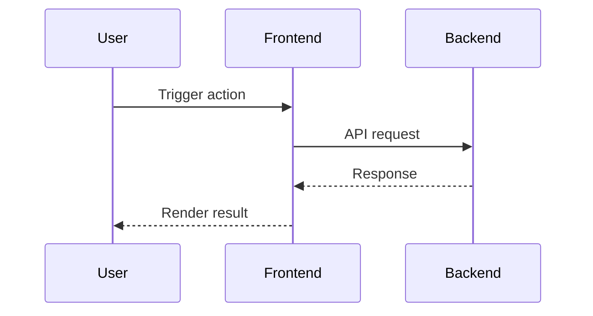

# #frontend-doc Command

> Load this file when `#frontend-doc` command is invoked.

---

## Purpose

Generate frontend development documentation based on backend API design.

### Constraints
- Do NOT generate backend implementation details or database schema documentation
- Do NOT fabricate APIs not present in architecture/design artifacts
- Do NOT include low-level request/response field specs unless explicitly requested

### Usage
- `#frontend-doc` - Generate full frontend API documentation for current change
- `#frontend-doc [feature/scope]` - Generate documentation for a specific feature or API scope

---

## Knowledge Dependencies

Before executing this command, load the following (if they exist):

| Path | Description | Required |
|------|-------------|----------|
| `workspace/project-context.yaml` | Project context (architecture + requirements) | Yes |
| `workspace/artifacts/{change-id}/design.md` | Detailed design document | Yes (if exists) |
| `workspace/artifacts/{change-id}/analysis.md` | Requirements analysis artifact | Yes (if exists) |

---

## Prerequisites Check

| Check | Condition | On Failure |
|-------|-----------|------------|
| Change scope available | A valid change-id or active change context exists | "No active change context found. Please provide a change-id or run `#status` to confirm current context." |
| Architecture exists | `workspace/project-context.yaml` architecture section is non-empty | "No architecture context found. Run `#design` first." |

---

## Execution Flow

**Step 1: Load Context**
- READ architecture and requirements artifacts
- Resolve feature scope from input arguments (or default to full scope)

**Step 2: Identify APIs**
- Extract relevant API endpoints from design artifacts
- Group APIs by frontend feature or user journey

**Step 3: Analyze Interaction Flows**
- Determine request/response sequence for core frontend actions
- Identify async states and failure paths that frontend must handle

**Step 4: Generate Documentation**
- WRITE `workspace/artifacts/{change-id}/frontend-api-doc.md`
- Include requirement background, API interface design, and interaction flow

**Step 5: Add Diagrams**
- Add Mermaid sequence diagram(s) for key flows

**Step 6: Validate Completeness**
- Check endpoint coverage and flow consistency
- Add integration suggestions only when special patterns exist

---

## Output Structure

````markdown
# Frontend API Documentation: {Feature Name}

## 1. Requirement Background

### Business Context
{Brief description of business need}

### User Stories
- As a {user type}, I want to {action} so that {benefit}

---

## 2. API Interface Design

### API Endpoints

| Method | Endpoint | Description |
|--------|----------|-------------|
| GET | `/api/v1/resource` | Get resource list |
| POST | `/api/v1/resource` | Create new resource |

### API Grouping
- **{Group Name}**: {group description}

---

## 3. Frontend-Backend Interaction Flow

### Main Flow



### Flow Description
1. {flow step 1}
2. {flow step 2}

---

## 4. Integration Suggestions

> Include only when special interaction patterns exist.

### Special Considerations
- {consideration}

### State Management
- {state recommendation}

### Error Handling
- {error handling strategy}

### Performance Considerations
- {performance recommendation}
````

---

## Output Location

Generated document path:
- `workspace/artifacts/{change-id}/frontend-api-doc.md`

---

## Example

```
User: #frontend-doc user-management

[Developer Mode]

# Frontend API Documentation: User Management

## 1. Requirement Background
...
```
