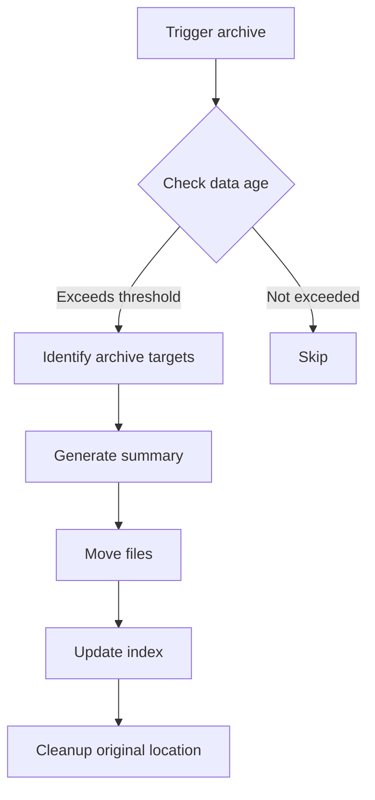

# Archive Manager

Archive manager responsible for handling historical data archiving and compression, keeping the workspace directory manageable.

## Trigger Timing

- `on_session_end`: When session ends
- `on_change_complete`: After change completion
- `scheduled: daily`: Daily scheduled execution

## Archive Rules

### Phase History Archive

**Trigger condition**: After phase completion

**Actions**:
1. Move detailed records to `history/phases/{date}/`
2. Update `history/phases/_index.yaml`
3. Keep only summary reference in `state/session.yaml`

**Example**:
```yaml
# history/phases/_index.yaml
entries:
  - date: "2026-02-15"
    count: 3
    summary: "Completed analysis and design phases"
    details_path: "2026-02-15/"
```

### Change Archive

**Trigger condition**: Change completed + older than 7 days

**Actions**:
1. Move change folder to `history/changes/{YYYYMM}/`
2. Compress detailed files, keep `summary.md`
3. Update `history/changes/_index.yaml`

**Example**:
```yaml
# history/changes/_index.yaml
entries:
  - month: "202602"
    count: 5
    changes:
      - id: "20260215-001-feature-auth"
        title: "User authentication feature"
        completed_at: "2026-02-15T16:00:00Z"
```

### Knowledge Cache Cleanup

**Trigger condition**: When session ends

**Actions**:
1. Clear loaded records in `state/knowledge-cache.yaml`
2. Preserve cache configuration

## Index Compression

Keep index files compact:

```yaml
# Before compression
phases:
  - date: "2026-02-15"
    phases:
      - phase: analyze
        agent: analyst
        started_at: "2026-02-15T10:00:00Z"
        completed_at: "2026-02-15T10:30:00Z"
        status: completed
        notes: "Detailed analysis completed..."
        # ... more details

# After compression
phases:
  - date: "2026-02-15"
    count: 3
    summary: "Completed analysis and design phases"
    details_path: "2026-02-15/"
```

## Retention Policy

| Data Type | Active Period | Post-Archive Retention |
|-----------|---------------|------------------------|
| session.yaml | Current session | Not retained |
| active-change.yaml | Current change | Move to history |
| phase details | 7 days | Summary only |
| change details | 30 days | summary.md |
| decisions | Permanent | Full retention |

## Execution Flow



## Output

After archive completion:

```yaml
# Archive log
archive_log:
  executed_at: "2026-02-16T00:00:00Z"
  actions:
    - type: phase_archive
      source: state/phase_history
      target: history/phases/2026-02-15/
      items: 3
      
    - type: change_archive
      source: artifacts/20260210-001-xxx/
      target: history/changes/202602/
      preserved: [summary.md]
```
