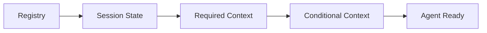
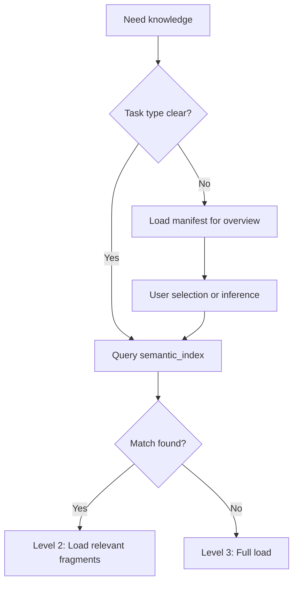

# Context Loader

Smart context loader that auto-executes on agent activation, loading required context based on the agent's context_contract.

## Loading Strategy

### Priority Loading

1. Read `registry.yaml` for global index
2. Read `workspace/state/session.yaml` for current state
3. Load required resources based on agent's `context_contract.required`

### Lazy Loading

1. Parse `context_contract.conditional` conditions
2. Load on-demand when actually needed
3. Cache loaded resources to avoid redundant reads

### Context Summary

Generate summaries for resources exceeding threshold:
- Threshold: 2000 tokens
- Strategy: Preserve structure + key information + examples

## Loading Order



## Knowledge Loading Levels

### Level 1: Manifest Only
- Load only `manifest.yaml`
- Get structure and summary information
- Token cost: ~200

### Level 2: Targeted Loading
- Select relevant parts from `semantic_index` based on current task
- Load only matching file fragments
- Token cost: ~500-1500

### Level 3: Full Loading
- Load complete knowledge pack
- Use only when explicitly needed
- Token cost: ~3000-5000

## Loading Decision Tree



## Cache Management

Loaded knowledge is cached to `workspace/state/knowledge-cache.yaml`:

```yaml
cache:
  session_id: "{session-uuid}"
  created_at: "2026-02-16T10:00:00Z"
  
loaded:
  - pack: core
    level: 3
    files_loaded: [software-principles.md]
    
  - pack: patterns/ddd
    level: 2
    fragments_loaded:
      - file: tactical-patterns.md
        sections: [entity, aggregate]
```

## Execution Steps

When agent activates:

1. **Check cache**: Read `knowledge-cache.yaml`
2. **Identify requirements**: Parse agent's `context_contract`
3. **Calculate diff**: Determine resources that need loading
4. **Execute loading**: Load resources by priority
5. **Update cache**: Record loaded content
6. **Report status**: Notify LLM of loaded context

## Output

After loading completes, report to LLM:

```markdown
## Context Loaded

### Required
- [x] knowledge/core/ (Level 3)
- [x] workspace/state/session.yaml

### Conditional (loaded)
- [x] knowledge/patterns/ddd/ (Level 2: entity, aggregate)

### Conditional (pending)
- [ ] knowledge/principle/coding-standards.md (Load condition: project initialized)
```
